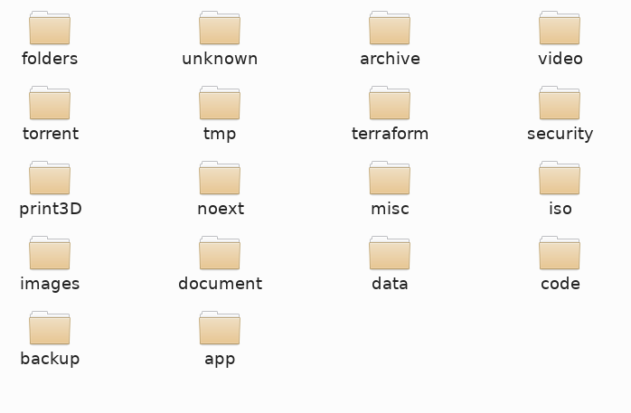

# File organizer

Put the .file-organizer.json in your ~/ , run the program and get files organized into sub folders described in the configuration file

* Get your files organized like this in no time



* configure file organization with a dead simple configuration file

```javascript
{
    "folder": "/tmp/tst",
    "files_types": [
        {
            "extension": "noext",
            "folder": "noext"
        },
        {
            "extension": "unknown",
            "folder": "unknown"
        },
        {
            "extension": "jpg",
            "folder": "images"
        },
        {
            "extension": "jpeg",
            "folder": "images"
        },
        {
            "extension": "png",
            "folder": "images"
        },
        {
            "extension": "mp3",
            "folder": "music"
        },
        {
            "extension": "flac",
            "folder": "music"
        }
    ]
}
```
